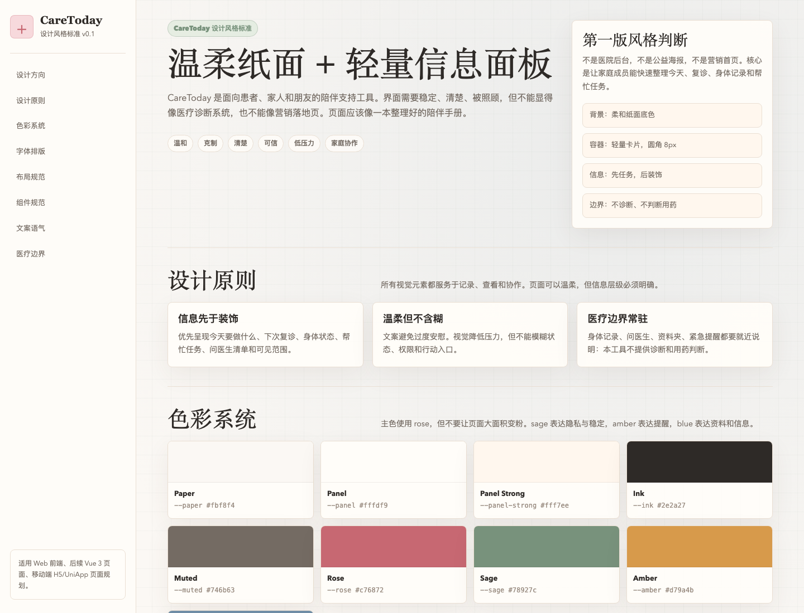

# CareToday

CareToday（陪你一起过今天）是一个面向患者、家人和朋友的陪伴支持 Web 工具。它不提供医疗诊断、治疗建议或用药判断，而是帮助一个家庭把复诊安排、身体记录、问医生清单、帮忙任务和陪伴留言整理在同一个空间里。

项目地址：[SNXJ/care-today](https://github.com/SNXJ/care-today.git)

## 项目定位

很多治疗过程里的压力不只来自疾病本身，也来自大量需要记住和协调的小事：什么时候复诊、报告放在哪里、想问医生什么、今天身体哪里不舒服、家人朋友能具体帮什么。

CareToday 希望把这些事变得更清楚一点：

- 患者不用一个人记住所有事情。
- 家人朋友可以把关心变成具体行动。
- 复诊前可以更快整理问题、症状和资料。
- 页面始终保持医疗边界，不替代医生意见。

## 当前状态

当前仓库处于早期原型阶段，当前首页 `index.html` 是 CareToday 设计风格标准页面，覆盖：

- 设计方向
- 设计原则
- 色彩系统
- 字体排版
- 布局规范
- 组件规范
- 文案语气
- 医疗边界

后续计划迁移为 Vue 3 Web 应用，并接入后端 API 和服务端数据库。

## 页面截图



## 设计风格标准

`index.html` 当前承载第一版设计风格标准，可直接作为视觉和前端实现参考。它把 `docs/design-style-guide.md` 中的规范转成可浏览页面，重点包括：

- 视觉方向：温柔纸面 + 轻量信息面板
- 色彩 token：基础色、功能色和使用边界
- 排版规则：标题 serif、正文 sans、字号层级和行高
- 布局规则：桌面左侧导航 + 主内容网格，移动端单列和底部导航预留
- 组件规则：卡片、按钮、标签、表单、Toast
- 文案规则：推荐表达、避免表达和医疗边界提示

## 功能规划

第一版计划支持：

- 登录与账号
- 创建陪伴空间
- 邀请家人/朋友加入空间
- 成员和权限管理
- 日历与复诊安排
- 身体状态记录
- 问医生清单
- 帮忙任务创建与认领
- 留言
- 资料/医嘱文本整理
- 隐私说明与免责声明

暂不支持：

- 在线问诊
- AI 医疗诊断
- 治疗方案推荐
- 用药判断
- 病情预测
- 商业药品、保险、医院推荐

## 技术规划

第一版建议技术栈：

- Frontend: Vue 3 + Vite
- Backend: Spring Boot 3 或 Node.js/NestJS
- Database: MySQL 或 PostgreSQL
- Deploy: Nginx + HTTPS + Docker Compose

二期可考虑：

- UniApp / 微信小程序
- 微信登录
- 用药或复诊提醒
- 文件上传与私有存储
- 资料导出
- 更细粒度权限

## 本地预览

设计风格标准页面可以直接打开：

```bash
open index.html
```

如果要预览 Vue 原型源码，可安装依赖：

```bash
npm install
```

启动本地开发服务器：

```bash
npm run dev
```

然后访问：

```text
http://localhost:5173
```

## 医疗边界

CareToday 仅用于生活陪伴、就诊整理和家庭协作。

本项目不提供医疗诊断、治疗建议或用药判断。涉及治疗方案、用药调整和症状处理，请以主治医生或医院意见为准。如出现明显不适、症状加重或紧急情况，请及时联系医生、医院或当地急救服务。

## 隐私与安全

项目会涉及医疗健康相关的敏感个人信息。正式上线版本必须至少满足：

- 全站 HTTPS
- 后端接口鉴权
- 空间数据按成员权限隔离
- 密码加密存储
- 敏感操作记录审计日志
- 用户可退出空间或删除账号
- 不在前端暴露服务端密钥
- 不把病情数据写入公开日志

## 目录

```text
care-today/
  index.html                设计风格标准页面
  患者陪伴需求文档.md        产品需求文档
  README.md                 项目说明
  docs/design-style-guide.md 设计风格规范文档
  docs/preview.png          设计风格标准页面截图
```

后续推荐结构：

```text
care-today/
  frontend/                 Vue 3 Web
  backend/                  API 服务
  deploy/                   Nginx、Docker Compose、备份脚本
  docs/                     需求、接口、部署文档
```

## License

暂未指定开源协议。正式开源前建议补充 `LICENSE` 文件。
